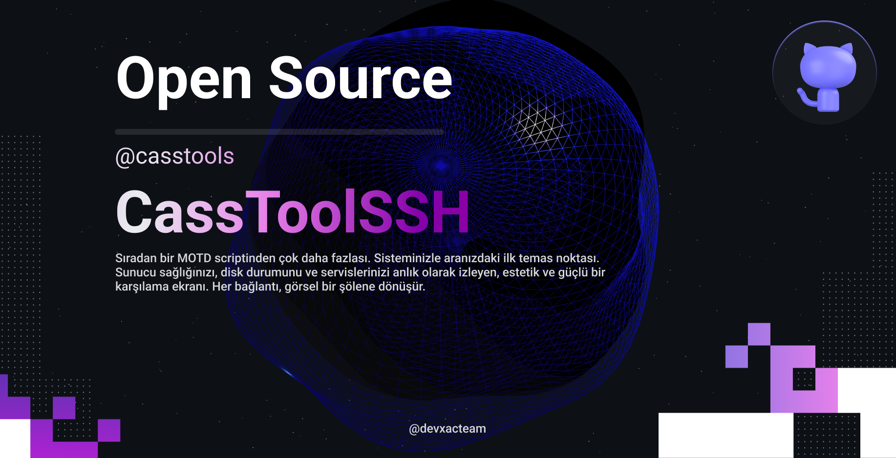

# CassToolSSH v1.0

**Linux için Profesyonel Sunucu Karşılama Sistemi**

SSH girişinizi gerçek zamanlı sistem istatistikleri, degrade (gradient) temalar ve özelleştirilebilir stillerle güzel, bilgilendirici bir karşılama ekranına dönüştürün.


---

## ✨ Özellikler

- 🎨 **10+ Degrade Tema** - Matrix, Ocean, Sunset, Fire, Ice, Neon ve daha fazlası
- 🖼️ **3 ASCII Sanat Stili** - Profesyonel, Minimal, Retro
- 📊 **Gerçek Zamanlı Sistem İstatistikleri** - Akıllı uyarılarla CPU, Bellek, Disk, Ağ takibi
- 🐳 **Docker Entegrasyonu** - Konteynır sayısı ve durum izleme
- 🔧 **Servis İzleme** - Kritik servislerinizi takip edin
- 🚦 **Akıllı Durum Göstergeleri** - Optimal, Orta, Ağır Yük tespiti
- ⚡ **Sıfır Bağımlılık** - Saf bash, her yerde çalışır
- 🎯 **Kolay Yönetim** - Tüm işlemler için basit `casstool` komutu

---

## 🎨 Stiller ve Temalar

### Stil 1: casstool (Profesyonel)

<details>
<summary>🔵 Ice Teması (Varsayılan)</summary>

```
 ██████╗ █████╗ ███████╗███████╗███╗   ███╗ █████╗ ██████╗ ██████╗  ██████╗ ██╗    ██╗
██╔════╝██╔══██╗██╔════╝██╔════╝████╗ ████║██╔══██╗██╔══██╗██╔══██╗██╔═══██╗██║    ██║
██║     ███████║███████╗███████╗██╔████╔██║███████║██████╔╝██████╔╝██║   ██║██║ █╗ ██║
██║     ██╔══██║╚════██║╚════██║██║╚██╔╝██║██╔══██║██╔══██╗██╔══██╗██║   ██║██║███╗██║
╚██████╗██║  ██║███████║███████║██║ ╚═╝ ██║██║  ██║██║  ██║██║  ██║╚██████╔╝╚███╔███╔╝
 ╚═════╝╚═╝  ╚═╝╚══════╝╚══════╝╚═╝     ╚═╝╚═╝  ╚═╝╚═╝  ╚═╝╚═╝  ╚═╝ ╚═════╝  ╚══╝╚══╝

Production Infrastructure  │  v1.0  │  ● OPTIMAL
────────────────────────────────────────────────────────────────────────────────

System               app.mycar724.com                      Kernel 6.8.0-87-generic
Uptime               7 days, 14 hours, 32 minutes          Load   0.45, 0.38, 0.32
Memory               3854 MB / 7941 MB (48.5%)
Disk (/)             118G / 145G (81%)
Local IP             192.168.1.100                         Public 203.0.113.42

Docker               ● Running (8 containers)

Services
  ● nginx
  ● docker
  ● postgresql
  ● redis

Last Login
  joel from 212.252.140.19 on Dec 21 00:20 at 00:20

────────────────────────────────────────────────────────────────────────────────
```
</details>

<details>
<summary>🟢 Matrix Teması</summary>


</details>

<details>
<summary>🌅 Sunset Teması</summary>


</details>

<details>
<summary>🔥 Fire Teması</summary>


</details>

<details>
<summary> Purple Neon Teması</summary>


</details>

### Stil 2: Minimal (Temiz ve Basit)

<details>
<summary>💼 Corporate Teması</summary>

```
╔════════════════════════════════════════════════════════════════════════════════╗
║                              C A S S M A R R O W                               ║
╠════════════════════════════════════════════════════════════════════════════════╣

Production Infrastructure  │  v1.0  │  ● OPTIMAL
╠════════════════════════════════════════════════════════════════════════════════╣

System               app.mycar724.com                      Kernel 6.8.0-87-generic
Uptime               7 days, 14 hours, 32 minutes          Load   0.45, 0.38, 0.32
Memory               3854 MB / 7941 MB (48.5%)
Disk (/)             118G / 145G (81%)

╚════════════════════════════════════════════════════════════════════════════════╝
```
</details>

### Stil 3: Retro (Klasik Terminal)

<details>
<summary>🟩 Hacker Teması</summary>

```
  ___   _   ___ ___ __  __   _   ___ ___  _____      __
 / __| /_\ / __/ __|  \/  | /_\ | _ \ _ \/ _ \ \    / /
| (__ / _ \\__ \__ \ |\/| |/ _ \|   /   / (_) \ \/\/ / 
 \___/_/ \_\___/___/_|  |_/_/ \_\_|_\_|_\\___/ \_/\_/  

Production Infrastructure  │  v1.0  │  ● OPTIMAL
────────────────────────────────────────────────────────────────────────────────

System               app.mycar724.com                      Kernel 6.8.0-87-generic
Uptime               7 days, 14 hours, 32 minutes          Load   0.45, 0.38, 0.32
Memory               3854 MB / 7941 MB (48.5%)

────────────────────────────────────────────────────────────────────────────────
```
</details>

---

## 🌈 Tüm Mevcut Temalar

| Tema | Açıklama | En İyi Kullanım |
|-------|-------------|----------|
| **ice** 🧊 | Camgöbeği-mavi degrade (varsayılan) | Modern teknoloji sunucuları |
| **matrix** 💚 | Yeşil matrix stili | Güvenlik/geliştirici sunucuları |
| **ocean** 🌊 | Derin mavi degrade | Prodüksiyon veritabanları |
| **sunset** 🌅 | Turuncu-pembe degrade | Kreatif projeler |
| **fire** 🔥 | Kırmızı-turuncu degrade | Kritik sistemler |
| **neon** 💜 | Mor-pembe degrade | Oyun/medya sunucuları |
| **hacker** 👾 | Koyu yeşil terminal | Sızma testi/güvenlik |
| **corporate** 💼 | Gri-mavi profesyonel | Kurumsal sunucular |
| **gold** 🏆 | Sarı-altın degrade | Premium hizmetler |
| **dracula** 🧛 | Mor koyu tema | Yazılımcı iş istasyonları |
| **forest** 🌲 | Yeşil doğa degrade | Çevre dostu projeler |
| **cosmic** 🌌 | Derin mor-mavi degrade | Uzay odaklı |
| **blue** 🔵 | Klasik mavi | Profesyonel kullanım |
| **green** 🟢 | Klasik yeşil | Başarılı prodüksiyon |
| **purple** 🟣 | Klasik mor | Kreatif işler |
| **cyan** 🔷 | Klasik camgöbeği | Teknoloji odaklı |
| **red** 🔴 | Klasik kırmızı | Uyarı/kritik |
| **yellow** 🟡 | Klasik sarı | Staging/test |

---

## 🚀 Hızlı Başlangıç

### Tek Satırda Kurulum

```bash
curl -fsSL https://raw.githubusercontent.com/ahmetakifcetin/CassToolSSH/main/install.sh | sudo bash
```

### Manuel Kurulum

```bash
# Kurulum dosyasını indirin
wget https://raw.githubusercontent.com/ahmetakifcetin/CassToolSSH/main/install.sh

# Çalıştırılabilir yapın
chmod +x install.sh

# Kurulumu çalıştırın
sudo ./install.sh
```

### İlk Adımlar

```bash
# Kurulumu test edin
casstool test

# Durumu kontrol edin
casstool status

# Temayı değiştirin
casstool theme

# Stili değiştirin
casstool style
```

---

## 🎮 Kullanım

### Yönetim Komutları

```bash
casstool status      # Mevcut yapılandırmayı gösterir
casstool enable      # SSH girişinde MOTD'yi etkinleştirir
casstool disable     # SSH girişinde MOTD'yi devre dışı bırakır
casstool test        # Mevcut kurulumu önizler
casstool theme       # Hızlı tema değiştirici
casstool style       # Hızlı stil değiştirici
casstool config      # Yapılandırma dosyasını düzenler
casstool customize   # Etkileşimli özelleştirme
casstool uninstall   # casstool'u kaldırır
```

### Hızlı Tema Değiştirme

```bash
# Etkileşimli menü
casstool theme

# Veya yapılandırmayı doğrudan düzenleyin
sudo nano /etc/casstool.conf
# Değiştirin: COLOR_THEME="ice"
```

### Hızlı Stil Değiştirme

```bash
# Mevcut stiller: casstool, minimal, retro
casstool style
```

---

## ⚙️ Yapılandırma

Yapılandırma dosyası: `/etc/casstool.conf`

```bash
# Ekran Ayarları
SHOW_HOSTNAME=true
SHOW_KERNEL=true
SHOW_UPTIME=true
SHOW_LOAD=true
SHOW_MEMORY=true
SHOW_DISK=true
SHOW_IP=true
SHOW_DOCKER=true
SHOW_SERVICES=true
SHOW_LAST_LOGIN=true

# Sistem Bilgisi
SYSTEM_NAME="Production Infrastructure"
SYSTEM_VERSION="v1.0"
CUSTOM_MESSAGE="Welcome to Production - Handle with care!"

# Tema ve Stil
COLOR_THEME="ice"        # Yukarıdaki tema tablosuna bakın
ASCII_STYLE="casstool" # casstool, minimal, retro

# İzlenecek Servisler
MONITORED_SERVICES="nginx docker postgresql mysql redis"

# MOTD Kontrolü
MOTD_ENABLED="true"
```

---

## 🎯 Kullanım Örnekleri

### Prodüksiyon Sunucusu (Fire Teması)

```bash
SYSTEM_NAME="Production API Server"
COLOR_THEME="fire"
ASCII_STYLE="casstool"
CUSTOM_MESSAGE="⚠️  PRODUCTION - Tüm değişiklikler onay gerektirir"
MONITORED_SERVICES="nginx docker postgresql redis"
```

### Geliştirme Sunucusu (Matrix Teması)

```bash
SYSTEM_NAME="Development Environment"
COLOR_THEME="matrix"
ASCII_STYLE="retro"
CUSTOM_MESSAGE="🚀 İyi kodlamalar! Bozun, öğrenin, tekrar edin."
MONITORED_SERVICES="docker postgresql"
```

### Veritabanı Sunucusu (Ocean Teması)

```bash
SYSTEM_NAME="PostgreSQL Cluster"
COLOR_THEME="ocean"
ASCII_STYLE="minimal"
CUSTOM_MESSAGE="🗄️  Veritabanı kümesi - Okuma kopyaları aktif"
MONITORED_SERVICES="postgresql pgbouncer redis"
```

### Güvenlik Sunucusu (Hacker Teması)

```bash
SYSTEM_NAME="Security Gateway"
COLOR_THEME="hacker"
ASCII_STYLE="retro"
CUSTOM_MESSAGE="🔒 Sadece yetkili erişim - Tüm işlemler günlüğe kaydedilir"
MONITORED_SERVICES="ssh fail2ban ufw iptables"
```

---

## 🚦 Akıllı Özellikler

### Durum Göstergeleri

- **● OPTIMAL** (Yeşil) - Yük < %70 - Sistem sorunsuz çalışıyor
- **● MODERATE** (Sarı) - Yük %70-%90 - Dikkat gerekebilir
- **● HEAVY LOAD** (Kırmızı) - Yük > %90 - Acil müdahale gerekebilir

### Bellek ve Disk Uyarıları

- **Normal**: `3854 MB / 7941 MB (%48.5)`
- **Uyarı** (%75+): `6120 MB / 7941 MB (%77.1)`
- **Kritik** (%90+): `7200 MB / 7941 MB (⚠ %90.7)`

### Docker Entegrasyonu

- Çalışan konteynır sayısını gösterir
- Docker daemon durumunu belirtir
- Docker yüklü olmadığında zarif bir şekilde işler

---

## 🛠️ Gelişmiş Özelleştirme

### Özel ASCII Sanatları

`/opt/casstool/motd.sh` dosyasını düzenleyin ve `print_ascii_art()` fonksiyonuna kendi ASCII sanatınızı ekleyin.

Daha fazla detay için [Katkı Sağlama Kılavuzu](docs/CONTRIBUTING.md) belgesine bakın.

### Özel Temalar

MOTD betiğindeki renk tanımlarını düzenleyerek kendi degrade temanızı oluşturun.

### Servis İzleme

İzleme listesine herhangi bir systemd servisi ekleyin:

```bash
MONITORED_SERVICES="nginx apache2 mysql postgresql redis mongodb docker gitlab-runner jenkins"
```

---

## 📋 Gereksinimler

- **İşletim Sistemi**: Ubuntu 20.04+, Debian 11+ veya uyumlu Linux dağıtımı
- **Kabuk**: Bash 4.0+
- **Ayrıcalıklar**: Kurulum için Root/sudo erişimi
- **Opsiyonel**: Docker (Docker durum göstergesi için)

---

## 🔧 Sorun Giderme

### MOTD Görünmüyor

```bash
# Etkin olup olmadığını kontrol edin
casstool status

# MOTD'yi etkinleştirin
casstool enable

# Manuel test edin
casstool test

# SSH konfigürasyonunu doğrulayın
grep PrintMotd /etc/ssh/sshd_config

# Şunu göstermelidir: PrintMotd yes
```

### Tema Uygulanmıyor

```bash
# Yapılandırmayı doğrulayın
cat /etc/casstool.conf | grep COLOR_THEME

# Farklı bir temayla test edin
sudo sed -i 's/COLOR_THEME=.*/COLOR_THEME="matrix"/' /etc/casstool.conf
casstool test
```

### Servisler Görünmüyor

```bash
# Mevcut servisleri listeleyin
systemctl list-units --type=service | grep -v '@'

# İzlenen servisleri güncelleyin
sudo nano /etc/casstool.conf
# Düzenleyin: MONITORED_SERVICES="nginx docker"
```

---

## 🗑️ Kaldırma

```bash
# Hızlı kaldırma
casstool uninstall

# Veya manuel olarak
sudo /opt/casstool/uninstall.sh
```

Bu işlem şunları yapar:
- Tüm casstool dosyalarını siler
- Orijinal MOTD yapılandırmasını geri yükler
- Yapılandırma dosyalarını temizler

---

## 🤝 Katkıda Bulunma

Katkılarınızı bekliyoruz! İşte nasıl yapılacağı:

1. Depoyu forklayın
2. Bir özellik dalı oluşturun (`git checkout -b feature/AmazingFeature`)
3. Değişikliklerinizi commit edin (`git commit -m 'Add AmazingFeature'`)
4. Dalınıza push yapın (`git push origin feature/AmazingFeature`)
5. Bir Pull Request açın

### Katkı Fikirleri

- [ ] Yeni ASCII sanat stilleri
- [ ] Ek degrade temalar
- [ ] GPU bilgi ekranı
- [ ] Ağ trafiği istatistikleri
- [ ] Çoklu dil desteği
- [ ] Hava durumu entegrasyonu
- [ ] Özel widget sistemi

---

## 📄 Lisans

Bu proje MIT Lisansı ile lisanslanmıştır - detaylar için [LICENSE](LICENSE) dosyasına bakın.

---

## 🙏 Teşekkürler

- [Joel](https://github.com/ahmetakifcetin) tarafından oluşturuldu
- Güzel ve profesyonel sunucu karşılamaları ihtiyacından esinlenildi
- Açık kaynak topluluğuna özel teşekkürler

---

## 📞 Destek

- 🐛 [Hata Bildir](https://github.com/ahmetakifcetin/CassToolSSH//H/issues/new?template=bug_report.md)
- 💡 [Özellik İste](https://github.com/ahmetakifcetin/CassToolSSH//H/issues/new?template=feature_request.md)
- 💬 [Tartışmalar](https://github.com/ahmetakifcetin/CassToolSSH//H/discussions)

---

## 🌟 Desteğinizi Gösterin

casstool'u faydalı buluyorsanız:
- ⭐ Depoya yıldız verin
- 🐦 Sosyal medyada paylaşın
- 🤝 Projeye katkıda bulunun

---

**Kendi sunucusunu barındıran (self-hosting) topluluğu için ❤️ ile yapıldı**

[GitHub](https://github.com/ahmetakifcetin/CassToolSSH//H) • [Issues](https://github.com/ahmetakifcetin/CassToolSSH//H/issues) • [Discussions](https://github.com/ahmetakifcetin/CassToolSSH//H/discussions)


